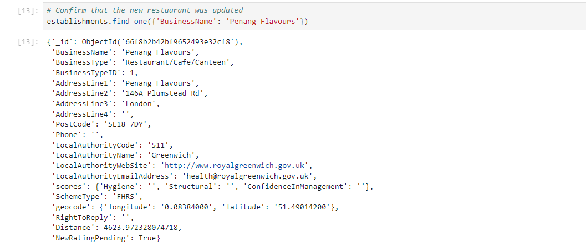

# NoSQL Analysis

## Website: 
[website](https://github.com/Damiomo/NoSQL-Analysis/tree/main)

## Description
I manage a mongo database and generate queries

## Table of Contents
- [Installation](#installation)
- [Usage](#usage)
- [Credits](#credits)
- [License](#license)

- [Contact](#contact)

## Installation
mongoClient, python, mongo, pandas, jupyter notebook

## Usage
run the two ipynb files

## Credits
Damilare Omoboriowo

## License
MIT

## Contact
If there are any questions or concerns, I can be reached at:
##### [github: Damiomo](https://github.com/Damiomo)
##### [email: Domoboriowo14@Gmail.com](mailto:Domoboriowo14@Gmail.com)
